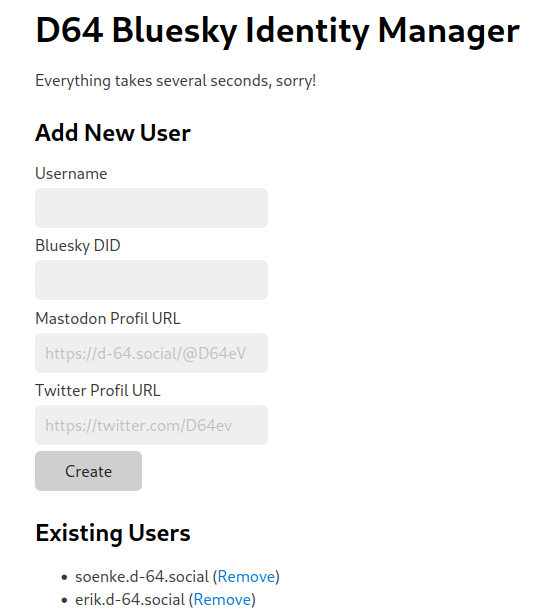

# D-64 Identity Service for Uberspace
As our service runs on [Uberspace](https://uberspace.de/en/), it uses the hoster's tooling to create subdomains, manage certificates, etc.

Please be advised that this is a proof-of-concept highly adapted to our environment, but nevertheless (to the best of our knowledge) secure and working for the scale of users we currently need to verify.

## Installation
1. Create a virtual environment
```bash
python -m venv venv
```
2. Install the requirements in `venv/`
```bash
source venv/bin/activate
pip install -r requirements.txt 
```

3. Create a file `settings.ini` with the following values:

```
[DEFAULT]
Prefix=URL_SUBDIR/
Domain=YOUR_DOMAIN
Path=Path to your /var/www/virtual/USERNAME/ directory
Secret=A long, random string
Port=PORT
WebsitePath=Full path to the "website" directory of this repo

[Authentication]
username=USER
password=PASS
```

`WebsitePath` must point to the local `website/` folder.

4. Host the static content from the `index/` folder at your webserver that you configured as `Domain`
5. Replace the paths leading to, e.g., a logo or CSS-file in `website/*` with that domain, e.g. `sed -i "s/https:\/\/admin.d-64.social/https:\/\/your-domain.com/ website/*`
6. Add it as uberspace backend:
`uberspace web backend set $Domain/$Prefix --http --remove-prefix --port PORT`

Make sure that Wildcard DNS A / AAAA entries resolve your domain to your uberspace.

For each user, the `website/index.php` file is copied to the users directory. The surrounding template is included, so you can adapt those files in `website/`.

## Usage
Login with your username and password at https://$Domain/$Prefix. You can now add or delete users.
Updating is not (yet) possible in the interface.
As for each user a Lets Encrypt certificate is requested, creation takes several seconds.



## How does it work?
For each user, a subdomain $username is created, e.g., erik.d-64.social.
A PHP script is copied to the document root which displays the social media accounts from a JSON file in the document root, see for example [https://erik.d-64.social/accounts.json](https://erik.d-64.social/accounts.json).
Links use the `rel="me"` attribute, so that, e.g., Mastodon displays the website as verified link.